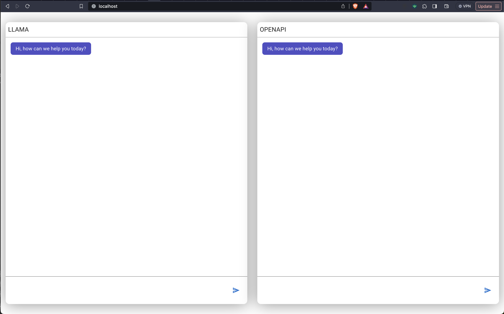

# @chat

A simple nestjs server with websockets for integrations with Llama2 and OpenAI

## Pre Requisites

- install llama locally, [guide](https://medium.com/@tushitdavergtu/how-to-install-llama-2-locally-d3e3c6c8eb4c)
  - copy the quantized binary to `/packages/server` as `gguf-llama2-chat-q4_0.bin`
- install [nvm](https://github.com/nvm-sh/nvm?tab=readme-ov-file#installing-and-updating)
- obtain your api key for [OpenAI](https://help.openai.com/en/articles/4936850-where-do-i-find-my-api-key)
  - you'll need to set `OPEN_API_KEY` via [.env.local](./packages/server/src/env/.env.local)
- bootstrap lerna repo
    ```bash
    nvm install
    npm i -g yarn
    yarn
    ```

---

## Running Project

```bash
yarn start
```

navigate to:

```bash
http://localhost
```

